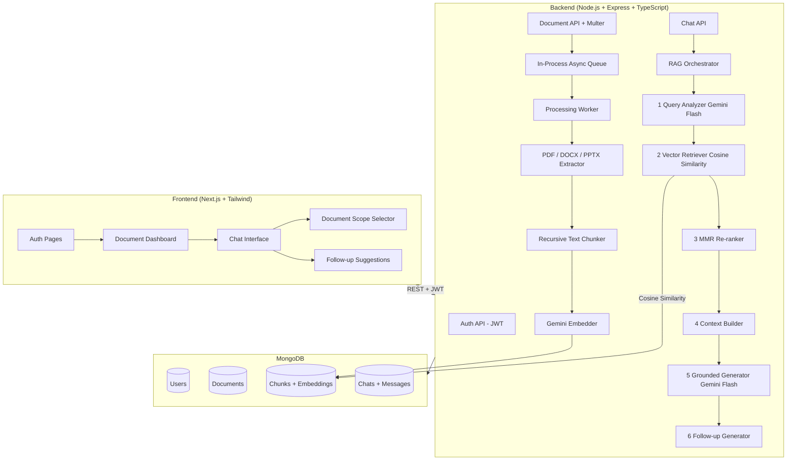

# DocIntel — Document Intelligence Platform

> A production-grade, multi-user RAG (Retrieval-Augmented Generation) system. Upload documents, ask questions, and receive grounded answers with source citations.

## 🚀 Live Demo
> _Update these URLs after deployment_
- **Frontend:** `<your-vercel-url>`
- **Backend:** `<your-railway-url>`

---

## 🏗️ Architecture



---

## ⚙️ Tech Stack

| Layer | Technology |
|-------|-----------|
| Frontend | Next.js 14 (App Router), Tailwind CSS, TypeScript |
| Backend | Node.js, Express.js, TypeScript |
| Database | MongoDB (Atlas / local) |
| Auth | JWT (jsonwebtoken) + bcryptjs |
| File Upload | Multer (disk storage) |
| PDF Extraction | pdf-parse |
| DOCX Extraction | mammoth |
| PPT Extraction | officeparser |
| Embeddings | Google Gemini text-embedding-004 (768-dim) |
| LLM | Google Gemini 2.0 Flash (generation + analysis/suggestions) |
| Deployment | Vercel (FE) + Railway (BE) |

---

## 📦 Setup Instructions

### Prerequisites
- Node.js 18+
- MongoDB Atlas account (or local MongoDB)
- Google Gemini API key (free at https://aistudio.google.com/apikey)

### 1. Clone
```bash
git clone https://github.com/your-username/docint.git
cd docint
```

### 2. Backend
```bash
cd backend
cp .env.example .env
# Edit .env with your MongoDB URI and Gemini API key
npm install
npm run dev
```

### 3. Frontend
```bash
cd frontend
# Edit .env.local if backend runs on different port
npm install
npm run dev
```

Frontend: http://localhost:3000  
Backend: http://localhost:5000

---

## 🔄 How Document Processing Works

1. **Upload** — User uploads a file via drag-and-drop. Multer saves it to disk and creates a `Document` record with `status: pending`.
2. **Queue** — The file path is pushed to an in-process Node.js `EventEmitter` queue (no Redis needed). The HTTP response returns immediately.
3. **Extract** — The worker selects the appropriate extractor:
   - PDF → `pdf-parse`
   - DOCX → `mammoth`
   - PPTX → `officeparser`
   - TXT → `fs.readFileSync`
4. **Chunk** — Text is split using a recursive character splitter (800 chars, 150 overlap). Splits on `\n\n` → `\n` → `. ` → ` ` in priority order to preserve semantic boundaries.
5. **Embed** — Chunks are batch-sent to Google Gemini `text-embedding-004` (up to 100 per request) to generate 768-dimensional vectors.
6. **Store** — `Chunk` documents (content + embedding + metadata) are inserted into MongoDB. `Document` status is updated to `ready`.

---

## 🧠 How Retrieval Works (Multi-Step RAG)

When a user sends a message, the system runs a **6-step RAG pipeline**:

| Step | Action | Model |
|------|--------|-------|
| 1 | **Query Analysis** — Resolve pronouns, extract intent, generate standalone query | Gemini 2.0 Flash |
| 2 | **Vector Retrieval** — Embed query, compute cosine similarity against all user chunks | In-app |
| 3 | **MMR Re-ranking** — Select 5 chunks that are relevant AND diverse (avoid redundancy) | In-app |
| 4 | **Context Building** — Format chunks with `[Source N]` references and resolve doc names | MongoDB |
| 5 | **Grounded Generation** — Generate answer strictly from context with citation markers | Gemini 2.0 Flash |
| 6 | **Follow-up Generation** — Suggest 3 related questions the user might want to ask next | Gemini 2.0 Flash |

**Hallucination prevention:** The system prompt explicitly instructs the LLM to only use provided context. If vector scores are below a threshold (0.25 cosine similarity), the system returns an "insufficient information" message instead of hallucinating.

---

## ✨ Advanced Feature: Document-Scoped Search + AI Follow-up Suggestions

### Document Scoping
Users can select specific documents to limit retrieval to. Instead of searching all documents, the retrieval filters chunks to only those belonging to the selected documents. This:
- **Prevents noise** from unrelated documents polluting results
- **Improves precision** significantly when the user knows which doc is relevant
- **Enables focused analysis** of a single document

### Follow-up Question Suggestions
After every AI response, the system generates 3 contextually relevant follow-up questions shown as clickable chips. Clicking auto-sends the question. This:
- **Guides users** who don't know what to ask next
- **Surfaces hidden insights** in the documents
- **Reduces friction** in exploration

---

## 🏛️ Design Decisions & Trade-offs

| Decision | Choice | Rationale |
|----------|--------|-----------|
| Vector DB | MongoDB (in-app cosine) | No extra service needed; simplifies ops; good enough for <100K chunks |
| Queue | In-process EventEmitter | No Redis required; simple; can be replaced with BullMQ for scale |
| Chunking | Recursive character splitter | Better semantic boundaries than fixed-size; no tokenizer dependency |
| Re-ranking | MMR (Jaccard-based) | Free, no API calls; prevents redundant chunks better than top-K alone |
| LLM grounding | System prompt + score threshold | Two-layer hallucination prevention |
| Auth | JWT (stateless) | Simple, scalable, works with Vercel/Railway |

### Known Limitations
- No OCR for scanned/image PDFs (would need Tesseract)
- No streaming responses (SSE/WebSockets can be added)
- Local disk storage (Railway ephemeral volume); S3 recommended for production scale
- Cosine similarity O(n) scan — fine up to ~50K chunks; MongoDB Atlas Vector Search index recommended beyond that
- In-process queue does not survive server restarts (pending jobs lost); use BullMQ + Redis for production resilience

---

## 🔒 Security

- All document and chat routes require a valid JWT
- MongoDB queries always filter by `userId` — users cannot access other users' data
- File type validation on both MIME type and extension
- Helmet.js HTTP security headers
- Password hashing with bcrypt (12 rounds)
